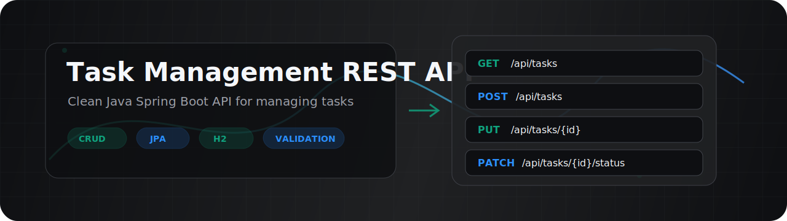

<p align="center">
  
</p>

<h1 align="center">Task Management REST API</h1>

<p align="center">
  <strong>A clean and beginner-friendly Java Spring Boot API for managing tasks.</strong>
</p>

<p align="center">
  
  
  
  
</p>

<p align="center">
  <a href="#overview">Overview</a> |
  <a href="#features">Features</a> |
  <a href="#architecture">Architecture</a> |
  <a href="#api-endpoints">API</a> |
  <a href="#run-locally">Run</a> |
  <a href="#postman-guide">Postman</a> |
  <a href="#testing">Testing</a>
</p>

---

## Overview

Task Management REST API is a portfolio-ready Spring Boot project that demonstrates how to build a clean backend API using beginner-friendly architecture.

The API lets users create, read, update, delete, search, and filter tasks. It uses DTOs for request and response models, validation for safe input, JPA for persistence, H2 for local development, and centralized exception handling for consistent errors.

---

## Features

| Feature | Description |
| --- | --- |
| CRUD Tasks | Create, list, find, update, and delete tasks |
| Status Updates | Change only the task status with a dedicated PATCH endpoint |
| Filtering | Filter tasks by `status`, `priority`, and text search |
| DTO Validation | Reject invalid request bodies before business logic runs |
| JPA Persistence | Store tasks using Spring Data JPA |
| H2 Console | Inspect the in-memory database in the browser |
| Seed Data | Load sample tasks when the app starts |
| Global Errors | Return consistent JSON errors for validation and not-found cases |
| Automated Tests | Includes service, controller, and repository tests |

---

## Technologies

| Technology | Role |
| --- | --- |
| Java 17 | Main programming language |
| Spring Boot | Application startup and configuration |
| Spring Web | REST API endpoints |
| Spring Data JPA | Repository and database persistence |
| Spring Validation | Request body validation |
| H2 Database | In-memory development database |
| Maven | Dependency management and build tool |
| JUnit 5 | Test framework |
| Mockito | Service unit test mocking |
| MockMvc | Controller endpoint testing |

---

## Architecture

This project uses a clean layered architecture:

```text
Client / Postman
      |
      v
TaskController
      |
      v
TaskService / TaskServiceImpl
      |
      v
TaskRepository
      |
      v
H2 Database
```

### Layer Responsibilities

| Layer | Files | Responsibility |
| --- | --- | --- |
| Controller | `TaskController` | Handles HTTP requests and responses |
| Service | `TaskService`, `TaskServiceImpl` | Contains application logic |
| Repository | `TaskRepository` | Handles database access |
| DTO | `TaskCreateRequest`, `TaskUpdateRequest`, `TaskStatusUpdateRequest`, `TaskResponse` | Defines API input and output |
| Entity | `Task` | Represents the database table |
| Mapper | `TaskMapper` | Converts between DTOs and entities |
| Exception Handling | `GlobalExceptionHandler`, `ApiError`, `TaskNotFoundException` | Produces consistent error responses |
| Config | `DataSeeder` | Adds sample data on startup |

### Why This Architecture Is Clean

| Principle | How This Project Applies It |
| --- | --- |
| Separation of concerns | Each layer has one clear responsibility |
| Thin controllers | Controllers delegate business logic to services |
| Isolated persistence | Database access is handled only by repositories |
| Stable API contract | DTOs separate external API models from internal JPA entities |
| Consistent errors | One global handler controls error response format |
| Testability | Service, controller, and repository layers can be tested separately |
| Beginner-friendly | No authentication, Docker, MapStruct, CQRS, or unnecessary abstractions |

---

## Project Structure

```text
task-management-api
  pom.xml
  README.md
  CHANGELOG.md
  PRESENTATION_SCRIPT.md
  docs
    assets
      banner.svg
  src
    main
      java
        com/example/taskmanagement
          TaskManagementApplication.java
          common
            exception
              ApiError.java
              GlobalExceptionHandler.java
          config
            DataSeeder.java
          task
            controller
              TaskController.java
            dto
              TaskCreateRequest.java
              TaskUpdateRequest.java
              TaskStatusUpdateRequest.java
              TaskResponse.java
            exception
              TaskNotFoundException.java
            mapper
              TaskMapper.java
            model
              Task.java
              TaskPriority.java
              TaskStatus.java
            repository
              TaskRepository.java
            service
              TaskService.java
              TaskServiceImpl.java
      resources
        application.yml
    test
      java
        com/example/taskmanagement/task
          controller
            TaskControllerTest.java
          repository
            TaskRepositoryTest.java
          service
            TaskServiceImplTest.java
```

---

## API Endpoints

Base URL:

```text
http://localhost:8080
```

| Method | Endpoint | Description |
| --- | --- | --- |
| `GET` | `/api/tasks` | List all tasks |
| `GET` | `/api/tasks?status=TODO` | Filter tasks by status |
| `GET` | `/api/tasks?priority=HIGH` | Filter tasks by priority |
| `GET` | `/api/tasks?search=project` | Search by title or description |
| `GET` | `/api/tasks/{id}` | Find one task by id |
| `POST` | `/api/tasks` | Create a task |
| `PUT` | `/api/tasks/{id}` | Update a full task |
| `PATCH` | `/api/tasks/{id}/status` | Change only task status |
| `DELETE` | `/api/tasks/{id}` | Delete a task |

### Task Status Values

| Value | Meaning |
| --- | --- |
| `TODO` | Task has not started |
| `IN_PROGRESS` | Task is being worked on |
| `DONE` | Task is complete |

### Task Priority Values

| Value | Meaning |
| --- | --- |
| `LOW` | Low priority |
| `MEDIUM` | Normal priority |
| `HIGH` | High priority |

---

## Request And Response Examples

### Create Task

Request:

```http
POST /api/tasks
Content-Type: application/json
```

```json
{
  "title": "Learn Spring Boot",
  "description": "Build and test a REST API",
  "priority": "HIGH",
  "dueDate": "2026-06-01"
}
```

Response:

```json
{
  "id": 1,
  "title": "Learn Spring Boot",
  "description": "Build and test a REST API",
  "status": "TODO",
  "priority": "HIGH",
  "dueDate": "2026-06-01",
  "createdAt": "2026-05-26T13:30:00",
  "updatedAt": "2026-05-26T13:30:00"
}
```

### Update Task

```http
PUT /api/tasks/1
Content-Type: application/json
```

```json
{
  "title": "Learn Spring Boot deeply",
  "description": "Practice controller, service, repository, DTO, and entity layers",
  "status": "IN_PROGRESS",
  "priority": "HIGH",
  "dueDate": "2026-06-03"
}
```

### Change Status

```http
PATCH /api/tasks/1/status
Content-Type: application/json
```

```json
{
  "status": "DONE"
}
```

### Not Found Error

```json
{
  "status": 404,
  "error": "Not Found",
  "message": "Task not found with id 99",
  "path": "/api/tasks/99",
  "timestamp": "2026-05-26T13:30:00"
}
```

### Validation Error

```json
{
  "status": 400,
  "error": "Bad Request",
  "message": "Validation failed",
  "path": "/api/tasks",
  "timestamp": "2026-05-26T13:30:00",
  "validationErrors": {
    "title": "Title is required"
  }
}
```

---

## Run Locally

### Prerequisites

| Tool | Version |
| --- | --- |
| Java | 17 or newer |
| Maven | 3.8 or newer |

### Start The API

```bash
cd task-management-api
mvn spring-boot:run
```

The application starts at:

```text
http://localhost:8080
```

---

## H2 Console

The project uses an in-memory H2 database, which is useful for development and learning because no external database server is required.

Open:

```text
http://localhost:8080/h2-console
```

Use:

| Field | Value |
| --- | --- |
| JDBC URL | `jdbc:h2:mem:taskdb` |
| User Name | `sa` |
| Password | leave empty |

Because the database is in memory, data is reset when the application stops. `DataSeeder` inserts sample tasks on startup.

---

## Postman Guide

### 1. List Tasks

| Setting | Value |
| --- | --- |
| Method | `GET` |
| URL | `http://localhost:8080/api/tasks` |

### 2. Create Task

| Setting | Value |
| --- | --- |
| Method | `POST` |
| URL | `http://localhost:8080/api/tasks` |
| Header | `Content-Type: application/json` |

Body:

```json
{
  "title": "Prepare portfolio demo",
  "description": "Test all endpoints in Postman",
  "priority": "HIGH",
  "dueDate": "2026-06-01"
}
```

### 3. Filter Tasks

| Filter | URL |
| --- | --- |
| By status | `http://localhost:8080/api/tasks?status=TODO` |
| By priority | `http://localhost:8080/api/tasks?priority=HIGH` |
| By search | `http://localhost:8080/api/tasks?search=portfolio` |

### 4. Update Task

| Setting | Value |
| --- | --- |
| Method | `PUT` |
| URL | `http://localhost:8080/api/tasks/1` |
| Header | `Content-Type: application/json` |

Body:

```json
{
  "title": "Prepare portfolio demo",
  "description": "Test the API and document the result",
  "status": "IN_PROGRESS",
  "priority": "HIGH",
  "dueDate": "2026-06-03"
}
```

### 5. Change Status

| Setting | Value |
| --- | --- |
| Method | `PATCH` |
| URL | `http://localhost:8080/api/tasks/1/status` |
| Header | `Content-Type: application/json` |

Body:

```json
{
  "status": "DONE"
}
```

### 6. Delete Task

| Setting | Value |
| --- | --- |
| Method | `DELETE` |
| URL | `http://localhost:8080/api/tasks/1` |
| Expected Response | `204 No Content` |

---

## Testing

Run all tests:

```bash
mvn test
```

Test coverage includes:

| Test Class | Focus |
| --- | --- |
| `TaskServiceImplTest` | Service behavior with Mockito |
| `TaskControllerTest` | REST endpoints, validation, and error responses with MockMvc |
| `TaskRepositoryTest` | JPA persistence and filtering with `@DataJpaTest` |

---

## Changelog

See [CHANGELOG.md](CHANGELOG.md) for release history.

---

## Portfolio Notes

This project is intentionally scoped for clarity:

```text
No authentication
No Docker
No MapStruct
No CQRS
No unnecessary abstractions
```

It focuses on the backend fundamentals that matter most in a first professional Spring Boot API:

```text
REST design
Layered architecture
DTO validation
JPA persistence
Error handling
Testing
Documentation
```
